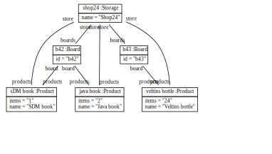

# StockTaker for simple tables. 

## Basic elements. 

There is a storage with name Shop24. 

There are products with name SDM book, Java book, Veltins bottle
and with items "1", "2", "24". 

There are boards with id b42 and b43.

Shop24 has boards and is store of b42 and b43.
Shop24 has products and is store of SDM book, Java book, Veltins bottle.
B42 has products and is board of SDM book, Java book.
B43 has products Veltins Bottle.

There is a shop-app with id shopper 
and with description "Shop 24 App".

There is a Page with id products-page 
and with description "button Login | button Scan | Products".
Shopper has content products-page. 
There is a Table with id prod-table. 
Products page has content prod-table. 
There is a Column with id name-col and with cells name of products of shop24.
There is a Column with id items-col and with cells items of products of shop24.
Prod-table has columns name-col and items-col. 

