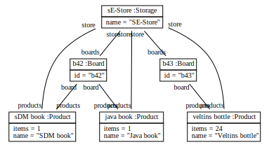
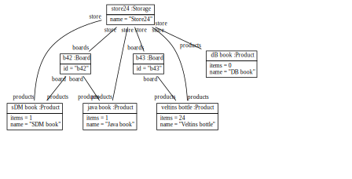
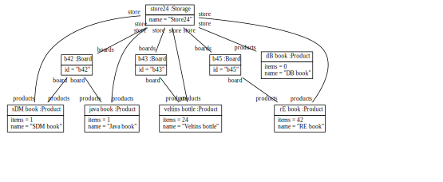

# StockTaker for books. 

## Basic elements. 

There is a storage with name SE-Store. 

There are products with name SDM book, Java book, Veltins bottle
and with items 1, 1, 24. 

There are boards with id b42 and b43.

SE-Store has boards and is store of b42 and b43.
SE-Store has products and is store of SDM book, Java book, Veltins bottle.
B42 has products and is board of SDM book, Java book.
B43 has products Veltins Bottle.

## GUI

There are contents with id name-in, pass-in
and with description "input name?", "input password?".
There is a content with id login-button and with description "button login"
and with action "do-login pal-in product-in items-in Scan".

There are elements with id product-code, product-name, product-items, product-board, del-button and 
with text "book-4004", "Story Driven Modeling", "1", "b-r1-c1", "button Del". 
Del-button has action "del-log-entry".
There is a content with id log-line1 and with elements product-code, product-name, product-items, product-board, del-button.

There is a Page with id login-page 
and with description "Login | button Scan | button Log"
and with content name-in, pass-in, login-button.

There is a Stock-App with id stock-taker 
and with description "Stock Taker"
and with content login-page 
and with user unknown.

## Controller

Stock-taker has storage SE-Store. 

## Prototype

### builder

We call find-board on stock-taker with board-id "b42". 
Find-board takes a board from boards of storage of stock-taker 
and as id of board is board-id, find-board answers with board.
Find-board creates the Board new-board. 
Find-board writes board-id into id of new-board. 
Find-board writes new-board into boards of storage of stock-taker.
Find-board answers with new-board. 

We call find-product on stock-taker with product-name "SDM book". 
Find-product takes a product from products of storage of stock-taker
and as name of product is product-name, find-product answers with product.

We call find-product on stock-taker with product-name "DB book". 
(As find-product cannot find DB book)
find-product creates the product new-product.   
Find-product writes product-name into name of new-product.
Find-product writes new-product into products of storage of stock-taker.
Find-product answers with new-product. 

### gui

We call login on stock-taker.
login creates a page with id login-screen 
and with description "Login | button Scan | button Log".
login writes login-screen into content of stock-taker.
login creates content with id login-in, password-in, login-button-in
and with description "input user?", "input password?", "button login".
login writes login-in, password-in, login-button-in into content of login-screen. 
login writes "runLogin login-in password-in scan" into action of login-button-in.

We call run-login on stock taker with login-name "Albert" and with password "geheim". 
Run-login writes "Albert's Stock Taker" into description of stock taker. 
Run-login writes login-name into user of stock taker. 

We call scan on stock-taker.
Scan creates content with id location-in, product-code-in, items-in, scan-button 
and with description 
  "input location bar code",
  "input product bar code?", 
  "input number of items?",
  "button Done".
Scan writes "runScan location-in product-code-in items-in log" into action of scan-button.   
Scan creates a page with id scan-screen 
and with description "button Login | Scan | button Log"
and with content location-in, product-code-in, items-in, scan-button.
Scan writes scan-screen into content of stock-taker.

We call run-scan on stock-taker with location b45, with product-code "RE book", with items 42.
Run-scan calls find-board with board-id location.
Run-scan writes the answer into my-board.
Run-scan calls find-product with product-name product-code. 
Run-scan writes the answer into my-product.
Run-scan writes items into items of my-product.
Run-scan adds my-product to products of my-board.  

We call log on stock-taker.
Log creates a page with id log-screen 
and with description "button Login | button Scan | Log". 
Log takes a product from products of storage of stock-taker
and log creates the content new-content 
and log writes name of product into id of new-content
and log writes new-content into content of log-screen
and log creates the Element name-elem 
and log writes name of product into text of name-elem
and log writes name-elem into elements of new-content
and log creates the Element items-elem 
and log writes "items of product" into text of items-elem
and log writes items-elem into elements of new-content
and as board of product is not empty,
log creates the Element board-elem 
and log writes id of board of product into text of board-elem
and log writes board-elem into elements of new-content.  
Log writes log-screen into content of stock-taker. 

We call init on stock-taker.
Init creates the Storage theStore and init writes "SE-Store" into name of theStore.
Init writes theStore into storage of stock-taker.
Init writes "stock-taker" into id of stock-taker.
Init writes "Stock Taker" into description of stock-taker. 
Init calls login.

