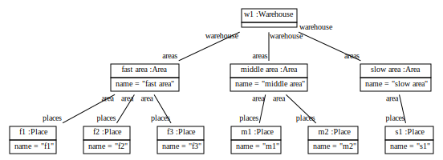
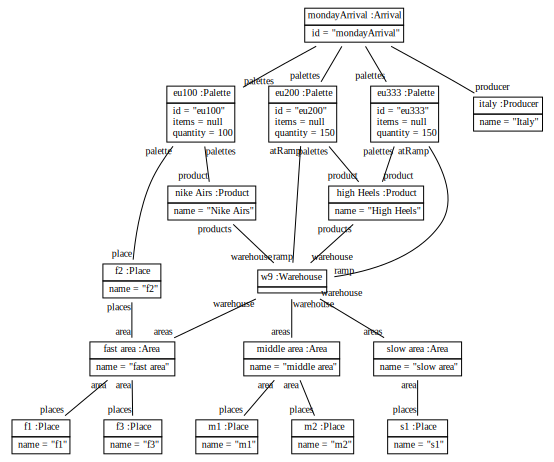

# Scenario Italy delivers Shoes.

  There is a Warehouse.
  There are Areas with name fast area, middle area and slow area.
  The Warehouse has areas and is warehouse of fast area, middle area 
  and slow area.
  There are Places with name f1, f2, f3, m1, m2, s1.
  Fast area has places and is area of f1, f2, f3.
  Middle area has places m1 and m2.
  Slow area has places s1.
  

There is a Producer with name Italy. 
There are Products with name High Heels, Nike Airs.  

There are Palette with id eu100, eu200, eu333
and with quantity 100, 150, 150.

High Heels has palettes and is product of eu200, eu333.
Nike Airs has palettes eu100.

Warehouse has products and is warehouse of High Heels and Nike Airs.
F2 has palette and is place of eu100.

There is an Arrival with id mondayArrival 
and with palettes
eu100, eu200, eu333 and with producer Italy. 

Warehouse has at-ramp and is ramp of eu200, eu333.

## GUI

  There are Content with id pal-in, product-in, items-in 
  and with description "input palette id?", "input product?", "input number of items?".
  There is a Content with id add-palette-button and with description "button submit"
  and with action "submit('add-palette pal-in product-in items-in')".
  
  There is a Page with id add-supply-page 
  and with description "New Supply | button Store Palettes"
  and with content pal-in, product-in, items-in, add-palette-button.
  
  There is a Web-App with id fork-lift-guide 
  and with description Fork Lift Guide
  and with content add-supply-page.

  There is a Web-App with id first-screen.
  We call init on first-Screen. 
  
  Init creates a Content with id pal-in, product-in, items-in
  and with description "input palette id?", "input product?", "input number of items?".
  Init creates a Content with id add-palette-button and with description "button submit"
  and with action "add-palette pal-in product-in items-in".
  
  Init creates a Page with id add-supply-page
  and with description "New Supply | button Store Palettes"
  and with content pal-in, product-in, items-in, add-palette-button. 
  
  Init writes "fork-lift-guide" into id of first-screen.
  Init writes "Fork Lift Guide" into description of first-screen.
  Init writes add-supply-page into content of first-screen. 
  
  Init answers with first-Screen. 
  
  
  We write "eu500" into value of pal-in.
  
  We write Sneakers into value of product-in. 
  
  We write "50" into value of items-in. 
  

## Operations

  We call find-product on Warehouse with product-name value of product-in.
  Find-product takes some-product High Heels from products of Warehouse and 
  as name of some-product is product-name, find-product answers with some-product.
  Find-product creates a Product new-product with name product-name. 
  Find-product answers with new-product into result.

  We call new-stock on Warehouse with new-pal-id value of pal-in 
  and with new-product-name value of product-in
  and with new-items value of items-in.
  
  New-stock creates a Palette new-pal with id new-pal-id
  and with items new-items.
  New-stock calls find-product on Warehouse with product-name new-product-name.

## Action Binding  
  
    
  
  

  
  